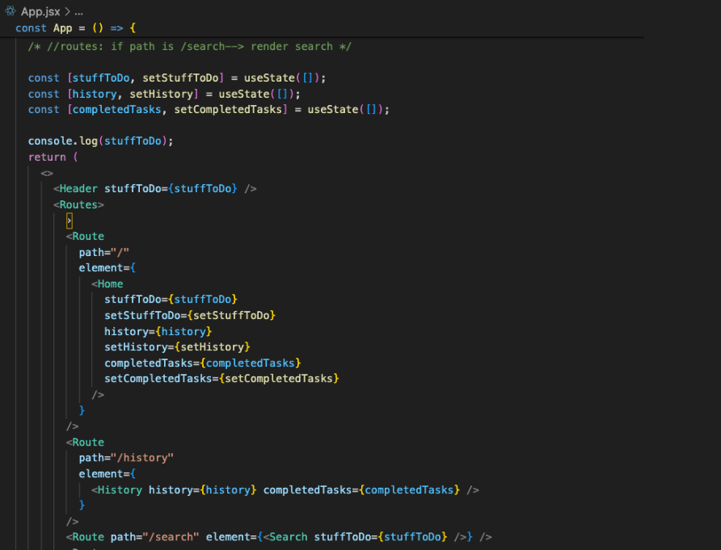

# Reading List React Tracker


---


# Intro
This project was created in my 14th week of coding bootcamp at General Assembly using React and CSS. The concepts of Javascript and HTML are indirectly used through my JSX returns. The code is an extension of my [Emojified React To Do App](https://github.com/ashleyd480/emojified-react-todo-app) and was created after about 5 days of instruction on React. Additional concepts used to create my reading tracker include routing, lifting state, and prop drilling.


---

# Overview
Users can use this app to add books that they want to read to a reading list. The counter at the top right dynamically changes based on how many books the user has to read in their list. 
Once a user is done reading a book, they can check it off their list. Otherwise if a user no longer wants to read a book, they can click on the trashcan icon to remove it off their list. 
The history tab shows books that the user has finished reading, as well as ones the user has removed from their reading list. Finally, the search bar allows users to search by book title, showing both books the user wants to read as well as ones they have completed (as indicated by the true/false status)

## Demo
I've recorded a quick ~ two minute demo that shows the user experience flow. You may watch that video [here](src/assets/book-tracker-demo.mov).

## Installation
When cloning the project for use- make sure to run  `npm i` to install required React dependencies on your local machine. Also, you will want to run the following two lines as my app users `react-router` and `react-icons`:

```
npm install react-icons -save
npm install react-router-dom

```

---

# Design

## Header 
The `Header` component consists of the ‘NavBar' and the `Counter` Our `App.jsx` (our entry point into the applications) has the `Header` and below that the `Routes`.  `stuffToDo` is a prop that represents the state of books to read (an array) is passed from App.jsx to `Header` and then to `NavBar` and `Counter` (both of which are child components of `Header`.) Doing it this way allows for the Header to persist across all pages. 

### Counter
The counter only displays a count when there are books to read- and we use a nullish coalescing operator (`&&`) to allow for that conditional rendering to happen. `notCompletedCount` filters the array of `stuffToDo`. It filters through each task (of book to read) and filters out the ones that are not completed, and then `.length` is used to check the length of books that are not yet read. 

```
const Counter = ({ stuffToDo }) => {
    const notCompletedCount = stuffToDo.filter(task => !task.completed).length;

    return (

      <div className="todo-icon">
            <LuListTodo size={"3em"} />
            
        {notCompletedCount > 0 && <span className="todo-count">{notCompletedCount}</span>}


```
### NavBar and Routes
In the NavBar, we have  `import { Link } from 'react-router-dom'` to use the `Link` component. `Link` accepts `to` prop which is the navigation target, in this case: Home, History, or Search. When you click on each link, it doesn’t refresh the page but rather just replaces the content with the content of that page. 

The system renders those components of Home, History, or Search because of the Routes we’ve defined in our `App.jsx`. Routes are essentially event listeners - which means that when we redirect to the path (defined in `NavBar`), we will render this component. 

Below is an example of the Route for the `History` component. When a user clicks on History from the navigation bar, the route is “/history”- and this will render the `History` component. 

```
  <Route
          path="/history"
          element={
            <History history={history} completedTasks={completedTasks} />
          }
        />
```

## Prop Drilling

Prop drilling is used primarily through the app as a way to pass down from parent to child - and must be done one layer at  a time. (Think of it like passing parameters in Java, where the values of something are provided and updated in the top layer, and a variable is used to represent that “something” in other functions”)

Prop drilling is observed in the `App.jsx` file where props for the `stuffToDo` (books to read), `history` and `completedTasks` are passed down to child components like `Home`, `History`, `Search`, and `TodoDetails`.
For example in `Home`, the `stuffToDo` is the variable representing the prop and the `{stuffToDo}` is the current state of `stuffToDo` which is defined “globally” in our screenshot below.



---

# Core Functionality (Home)
As mentioned, there are three main Routes in my app: `Home`, `History`, and `Search`. 

`Home` container has a blurb with user instructions (which is `Main.jsx` component), and hosts the main user interface for interacting with books (which is the `ToDoListManager.jsx` component).


## ToDoListManager
`ToDoListManager` receives the `stuffToDo` (books to read), `history`, and `completedTasks` props which were initialized in `App.jsx` and passed down to `Home` and then to `ToDoListManager` via prop drilling. 

```
const ToDoListManager = ({
  stuffToDo,
  setStuffToDo,
  history,
  setHistory,
  completedTasks,
  setCompletedTasks,
}) => {
```
Similar to my [Emojified React To Do App](https://github.com/ashleyd480/emojified-react-todo-app), there are the pre-existing functions to handleInput by reading the `event.target.value` upon input field’s value changing, deleting a task (book to read), and deleting all, as well as marking a task (book) as complete. 

One new feature is when adding a new task (book to read) with `handleAddTask`, we are adding an object with key-value pairs of `id` which is generated by the next index of the `stuffToDo` array (or `stuffToDo.length+ 1`), the `task` name which is the what the user inputs as the book title they want to read, and the `completed` status which is initialized as false. 

## ToDo
For separation of concern, the `ToDo.jsx` component is used to render the presentation of the “todo” (books to read) interface section of the Home page. It includes a short title blurb. In addition to the other aforementioned props  of `stuffToDo`, etc, the event listener functions of `handleInput`, `handleAddTask`, etc are received as props here (passed from `ToDoListManager`). This is because the buttons for adding, deleting, etc are on the `ToDo.jsx` and the buttons have an onClickFunction, whose functionality is defined in the `ToDoListManager`. 

## List and To Do Details 
`ToDo.Jsx` also renders the `List` component and passes down the `stuffToDo` and `setCompletedTasks` down to `List.`

The `List` component maps over the array of `stuffToDo` and with each book (represented by the `item` variable)- it creates a div.

This div contains the book that the user wants to read along with the interactive buttons to mark  a book as completed, or to delete that book. 

In the example below, `listFunction` is the prop variable for handling deletion of a single book. The system would know which book to delete because of the `index` which is generated by the mapping (as it maps over, each div has a unique index “assigned” to it).

` <Button color={"gray"} onClickFunction={() => listFunction(index)}>`

The mapping also creates a Link component for each book, with the url dynamically set to the item’s `item.id`. The text of the link is the `item.task` - which is the title of the book the user wants to read. Remember from earlier how each time a book is added, the name of the book is added as a key value pair.

```
     <Link to={`/todos/${item.id}`}>
            <li className={item.completed ? "completed-task" : ""}>
              {item.task}
            </li>
          </Link>
```

 


### useParams 
The path for the To Do Details is defined in our `App.jsx` as a route so that it knows when the url says for example “http://localhost:3000/todos/3”, the page will render the ToDoDetails component with information for the book with that id. 

In ToDoDetails.jsx, we import `useParams` from react-router-dom. This hook allows us to extract route parameters from the URL. Specifically, we use useParams to get the id parameter from the URL. Since URL parameters are strings, we use parseInt(id) to convert this id from a string to an integer. This integer id is then used to dynamically display the information for the to-do item with that specific ID.

To find the to-do item that matches the ID from the URL, we use the following code 
` const todoItem = stuffToDo.find((t) => t.id === todoId)` 
The code iterates through the `stuffToDo` array and uses `.find` to check each item to find the single one that matches the id parameter of the URL, assigning the result the variable `todoItem`. 

Each todoItem has those key-value pairs from earlier so we can use dot notation to access their properties. We want to do it this way since React is not able to  directly render objects. 

```
<li>Book: {todoItem.task} </li>
<li>Id: {todoItem.id} </li>
```

# History Display 
`History` renders the history of books read and books removed (that the user no longer wants to read). With each respectively, it checks the length of the arrays of `completedTasks` and `history` (these are props which are passed down from `App.jsx`)


The ternary operator will either display a message if there are no books matching that condition (if the array is empty), or it will show a list of the books under its respective category. 
When there is no history to display...


## History 
`History` is updated when a book/books are deleted. 
In `ToDoListManager.jsx`, the handleDeleteTasks` adds all tasks to the history before clearing the `stuffToDo`. In other words, we add the current `stuffToDo` on top of our existing `history` array.  The same logic is applied with `handleDeleteOneTask`.

```
  const handleDeleteAllTasks = () => {
    if (stuffToDo.length > 0) {
      setHistory([...history, ...stuffToDo]);
      setStuffToDo([]);
```

## Completed Tasks
The state of `completedTasks` is managed through the `List` component. Remember how each book once added has an `item.completed` property that is initially set as false.  

```
    <input
              type="checkbox"
              className="checkbox"
              checked={item.completed}
              onChange={() => handleCheckboxChange(index)}
            />
```

`checked={item.completed}` means the checkbox will be checked if the state of our key value pair for the book’s state of `item.completed` is true. This is to ensure that when we initially render the checkboxes, that the checkboxes correctly show a check or not based on the current state of the book’s completion. Once rendered, `handleCheckboxChange` listens for the checkbox being clicked by the user and toggles the status to “completed” if an uncompleted book is checked. The completed books are then added to the array of `completedTasks`


# Search Page
`Search` allows a user to query for books and the book, id, and completion status are rendered.
‘searchQuery` is set by listening for the `onChange` input of the search bar’s input with `event.target.value`. When the search button is clicked, `displaySearchResults` handles it by filtering through `stuffToDo` which includes completed and incomplete books. This design was intentional, allowing users to get a view of books they’ve read and books they haven’t yet finished reading. 


---

# What I’ve learned

## Toggling With ! Operator 
Implementing the checkboxes for completion was one of the most challenging aspects to implement. 

As mentioned in [Completed Tasks](#completed-tasks), the `checked` attribute of the checkbox is what determines how the checkbox initially renders based on `item.completed`. Only if true, is the checkbox checked. That’s why our checkboxes of newly added books render as unchecked, since when a book is added, it has a completion status of `false`. 

Then `handleCheckboxChange` listens to the user checking the box

This line assigns the toggled completion status back to the completed property of the task object in toDoListArray. So, if the task was completed, when  a user checks the box, it will now be marked as incomplete, and vice versa: 
`toDoListArray[index].completed = !toDoListArray[index].completed;`

To further explain, the ! operator negates the current value of completed. If completed is true, !completed will be false, and vice versa. This effectively toggles the completion status of the task.

To ensure these book items with their updated completion status are saved, we need to then `setStuffToDo` to `toDoListArray` (which is a copy of the `stuffToDo` represented by the `listMappingOver` prop variable); the copy is for the principle of immutability and and to ensure that React can efficiently detect changes in state. By updating the stuffToDo state with the modified array, React will recognize the change and trigger a re-render of the component with the updated book items and their completion status.
    setStuffToDo(toDoListArray);
    if (toDoListArray[index].completed) {
      setCompletedTasks([...completedTasks, toDoListArray[index]]);
    }
  };

If we don't call setStuffToDo to update the stuffToDo state with the modified array, React wouldn't know that the state has changed, and therefore, it wouldn't trigger a re-render of the component with the updated completion status.

### State Dependency 
Even though we do `setCompletedTasks`, `completedTasks` is derived from `stuffToDo` (specifically, from books that are marked as completed via the `if (toDoListArray[index].completed)` in the code block above which then is what triggers the `setCompletedTask`). Because of this dependency, we need to ensure we update `stuffToDo` first before updating `completedTasks.` Otherwise, without updating `stuffToDo`, `completedTasks` array would still be based on the old state, potentially leading to inconsistencies.

## Lifting State Up

Lifting state up is a technique used to avoid prop drilling. By moving the state to a higher-level component in the component tree, we can make that state accessible to all child components that need it without passing it explicitly through intermediate components.

One example is: To pass the `completedTasks` from `List.jsx` to `History.jsx`, we needed to lift the state up to a common ancestor component. In this case, it was lifted up to `App.jsx`, and then passed down to History.jsx as a prop. 

In other words, the `List` component sets the `completedTasks` via  `handleCheckboxChange`. `App.jsx` is the parent of both the `List` and `History` element, which means that both of those elements can access the value of the `completedTasks`.  (Note:  The parent component contains the child component in its JSX structure, aka the child components are nested within the parent component.)


## Falsy Conditional

When we were looking at [To Do Details](#list-and-to-do-details), we saw how we iterate through `stuffToDo` to find the matching stuffToDo with that `id` and the return of that method is assigned the variable of `toDoItem`. 


The condition if (!todoItem) is used to check if todoItem is "falsy." In JavaScript, a "falsy" value is one that is considered false when encountered in a Boolean context. The falsy values in JavaScript are: false, 0, "" (empty string), null, undefined, NaN.

If todoItem is null, undefined, or any other falsy value, the condition evaluates to true, indicating that todoItem is not valid or does not exist. This allows us to handle cases where the search for the specific stuffToDo item with the given `id` fails to return a valid result. In this case, we render a message saying “book item not found”.


# Thinking Ahead
## Containers vs Components 
One thing I learned that I would like to integrate into my next project is that typically, components in React should be presentational. Containers, on the other hand, should be where logic is handled. In my case, I had it flipped- where my containers were mostly presentational. 

## Passing State Efficiently
While prop drilling was able to work for passing the state variable’s value to the child components and getting its updated value from calculations conducted on the child component level (bidirectional data flow), this type of drilling is not ideal for larger apps due to the level of complexity which can make debugging and managing state very difficult. 

## stuffToDo State
Currently `stuffToDo` does include completed books. This was done so that when searching for `stuffToDo` both the completed and the non-completed books show. However, the search can be refined by filtering out `completed` books. For example, a checkbox can be added that when checked, we would only show non-completed books. We could do this by rendering a `filteredToDoList`.

That filtered list can be achieved by: if  the task is completed, remove it from the stuffToDo list
```
if (updatedToDoList[index].completed) {
    const filteredToDoList = updatedToDoList.filter((task, i) => i !== index);
    setStuffToDo(filteredToDoList);
  }
```